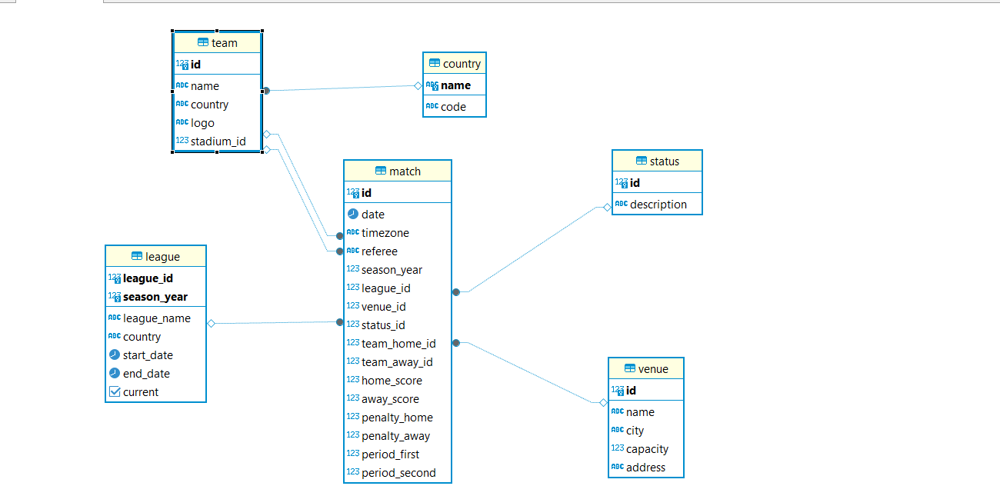

# Football API

Esta aplicación fue desarrollada para analizar los partidos de fútbol en Argentina, utilizando datos proporcionados por la API dinámica de [API-Football](https://www.api-football.com/). El objetivo es automatizar el proceso de carga, transformación y análisis de datos utilizando Apache Airflow para la orquestación de tareas.

## Índice
1. [Instalaciones y Configuraciones](#instalacion-y-configuraciones)
2. [Setup](#setup)
3. [Modelo de Datos](#modelo-de-datos)
4. [Llamados a la API](#llamados-a-la-api)
5. [Estructura del proyecto](#estructura-del-proyecto)
5. [Arquitectura del Proyecto](#arquitectura-del-proyecto)
6. [Dags de Apache Airflow](#dags-de-apache-airflow)
7. [Estadísticas Calculadas](#estadísticas-calculadas)
8. [Ejecución del Proyecto](#ejecución-del-proyecto)


## Instalaciones y Configuraciones

- Python
- Docker
- AWS Redshift
- Airflow
- postman
- Dbear
- Visual studio

## Setup

Sigue estos pasos para configurar y ejecutar el proyecto localmente:

### 1. Clona este repositorio

```bash
git clone https://github.com/MichelleBidart/futbol_hoy.git
```

el proyecto está en master

Copiar el fichero .env en la raiz 
```bash
cd futbol_hoy
```

## Modelo de Datos

El modelo de datos sigue un enfoque de **Diagrama Estrella (Star Schema)**, que facilita la consulta de datos para el análisis de rendimiento de equipos, ligas y partidos.

### Diagrama Entidad-Relación (DER)



El diagrama estrella incluye una tabla central de hechos y varias tablas de dimensiones relacionadas:

- **Tabla de Hechos: `match`**
  - Almacena información detallada sobre los partidos, incluyendo el identificador único de cada encuentro, la liga a la que pertenece, el año de la temporada en la que se jugó, los equipos que participaron (local y visitante), los goles anotados por cada equipo y la fecha del partido.

- **Tablas de Dimensiones:**
  - **Dimensión `league`**
    - Contiene información sobre las ligas, como el nombre, el país donde se juega, el año de la temporada y el periodo en que tiene lugar.

  - **Dimensión `team`**
    - Proporciona detalles sobre los equipos de fútbol, como el nombre del equipo, el país al que pertenece y el estadio donde juega como local.

  - **Dimensión `venue`**
    - Incluye datos sobre los estadios, tales como su ubicación, capacidad y dirección.
## Estructura del proyecto

# Estructura del Proyecto

```project-tree
futbol_hoy/
├── airflow/               
│   ├── dags/                        
├── bronze/                  
├── silver/                 
├── gold/                                                 
├── etl/                    
├── scripts/                                 
├── tests/                 
├── utils/                  
├── .env                    
├── .gitignore              
├── docker-compose.yaml    
├── Dockerfile                                        
├── README.md               
└── requirements.txt  
```      


## Arquitectura del Proyecto

El proyecto utiliza dos enfoques diferentes para gestionar los datos:

1. **Enfoque ETL para Ligas, Países, Equipos y Estadios:**
   - Para estas entidades, se sigue un enfoque tradicional de **ETL (Extract, Transform, Load)**. Los datos son extraídos de la API, transformados según las necesidades del negocio y luego cargados directamente en la base de datos. Este enfoque permite la actualización mensual de las ligas y una carga inicial de países, equipos y estadios.

2. **Arquitectura en Capas para Partidos (Bronze, Silver, Gold):**
   - Para los datos de partidos, se utiliza una arquitectura de datos en capas:
     - **Bronze**: Datos en crudo, tal como llegan de la API, sin realizar transformaciones
     - **Silver**: Datos limpiados y transformados y  guardado normalizado en la base de datos.
     - **Gold**: Datos optimizados para la generación de reportes

### Proceso de Inicialización

Cuando se ejecuta por primera vez Docker Compose, se realiza lo siguiente:
1. Se ejecuta el script `script_tables.sql`, que crea las tablas necesarias para el proyecto.
2. Se realiza una carga inicial única de datos para:
   - Países (countries), insertados en la tabla `country`.
   - Equipos (teams), insertados en la tabla `team`.
   - Estadios (venues), insertados en la tabla `venue`.

Los scripts están diseñados para ser **idempotentes**, permitiendo la ejecución múltiple sin causar conflictos. Si las tablas ya existen, no se vuelven a crear, y los datos se recargan eliminando los registros previos antes de la nueva inserción.

## Llamados a la API

El proyecto realiza varios llamados a la API para extraer los datos de diferentes entidades. A continuación, se describen los principales endpoints utilizados, junto con el método HTTP y el formato del endpoint.

| Entidad          | Método HTTP | Endpoint                                                       | Descripción                                                      |
|------------------|-------------|----------------------------------------------------------------|------------------------------------------------------------------|
| **Países**       | `GET`       | `https://v3.football.api-sports.io/countries`                  | Obtiene una lista de todos los países disponibles.               |
| **Equipos**      | `GET`       | `https://v3.football.api-sports.io/teams?country=Argentina`    | Extrae información sobre equipos de fútbol en Argentina.         |
| **Estadios**     | `GET`       | `https://v3.football.api-sports.io/venues`                     | Proporciona datos sobre los estadios donde se juegan los partidos. |
| **Ligas**        | `GET`       | `https://v3.football.api-sports.io/leagues`                    | Extrae información sobre las ligas de fútbol, incluyendo nombre, país, y temporadas. |
| **Partidos**     | `GET`       | `https://v3.football.api-sports.io/fixtures?date={yyyy-mm-dd}` | Obtiene información de los partidos para una fecha específica.   |

### Autenticación

Todos los llamados a la API requieren autenticación mediante una **API Key**. La clave de acceso se almacena en un archivo `.env` para mantener la seguridad y evitar la exposición de credenciales sensibles

## Dags de Apache Airflow

El proyecto cuenta con dos DAGs principales para la orquestación de tareas en Apache Airflow:

1. **DAG de Ligas**: Se ejecuta mensualmente y sigue el enfoque ETL para actualizar los datos de las ligas.
2. **DAG de Partidos**: Se ejecuta diariamente, aplicando la arquitectura en capas (bronze, silver, gold) para actualizar los datos de los partidos del día anterior.

## Estadísticas Calculadas

El sistema calcula las siguientes estadísticas:

1. **Estadísticas de Goles por Liga:**
   - Se calculan los goles totales anotados en cada liga

2. **Resultados por Equipo en Ligas Actuales:**
   - Se analiza el rendimiento de los equipos en ligas actuales, calculando el número de victorias, empates y derrotas, tanto en partidos locales como de visitante.

## Ejecución del Proyecto

Para ejecutar el proyecto de forma local, sigue estos pasos:

1. Levantar el entorno con Docker Compose:
    ```bash
    docker-compose up --build
    ```

2. Acceder a la interfaz web de Airflow:
    - La interfaz web está disponible en [localhost:8080](http://localhost:8080).

### Ejecución de Partidos Anteriores

Para ejecutar la carga de partidos en fechas anteriores, sigue estos pasos:

1. Accede al contenedor del servidor web de Airflow:
    ```bash
    docker exec -it <airflow-webserver-id> /bin/bash
    ```

2. Ejecuta el comando de backfill para las fechas deseadas:
    ```bash
    airflow dags backfill -s yyyy-mm-dd -e yyyy-mm-dd <dag_id>
    ```
   Reemplaza `<dag_id>` con el ID del DAG que deseas ejecutar, daily_fixtures_etl_dag_argentina

